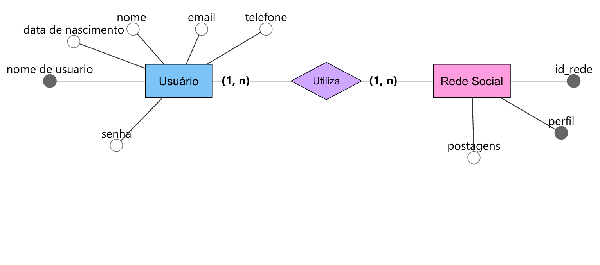

## Projeto Banco de Dados
**Nome do Projeto** : Sistema de postagens derede social
**Equipe de Desenvolvimento** : Laura & Sophia

## Visão geral do Sistema (Escopo)
O objetivo é permitir com que os usuarios expressem seus pensamentos e opinioes atraves de um sistema eficiente de postagens e com3entarios

## Requisitos Funcionai (RF)
**RF01**:O sistema deve permitir que o usuario realize o cadastros com essas informações:

- Nome
- E-mail
- Telefone
- Nome de Usuário
- Data de nascimento

**RF02** o sistema deve permitir o usuário acessar a biblioteca de fotos para postar.

**RF02** o sistema deve permitir que a pessoa comente nas postagens 

## Modelo conceitual

